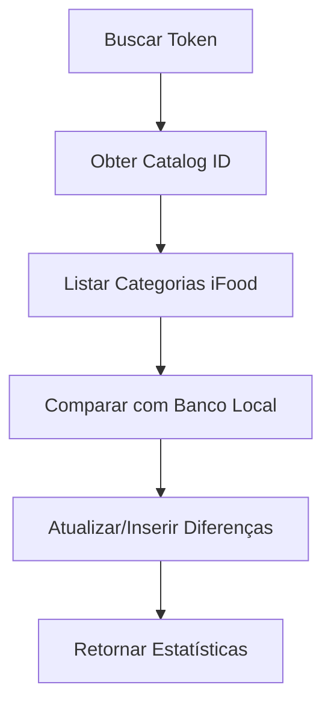
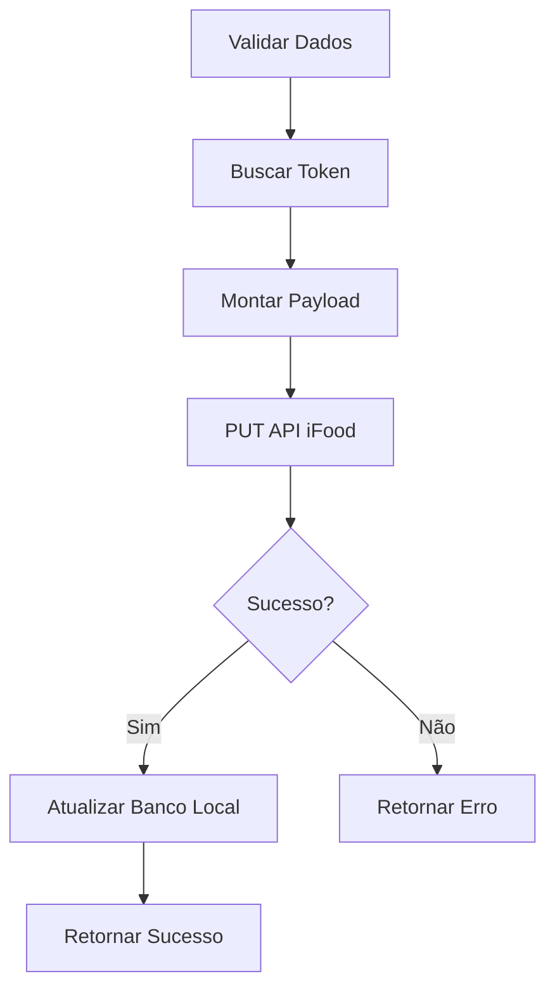
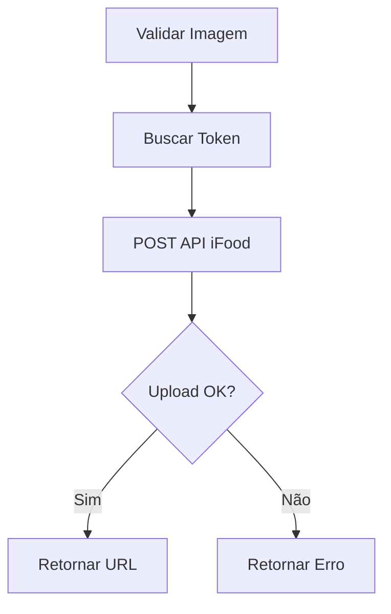

  # IFoodProductService

**Módulo de Integração com Catálogo iFood**

## 📋 Visão Geral

O `IFoodProductService` é a **classe principal** responsável pela integração com a API de Catálogo do iFood. Este serviço implementa todas as operações obrigatórias para homologação iFood, permitindo gerenciar produtos, categorias, preços, status e imagens através da API oficial.

### 🎯 Propósito
- **Integração completa** com API iFood Catalog v2.0
- **Gerenciamento de catálogo** (categorias, produtos, opções)
- **Sincronização bidirecional** entre sistema local e iFood
- **Operações CRUD** para todos os elementos do catálogo
- **Upload e gerenciamento** de imagens de produtos

### 🔗 Dependências
- **Supabase**: Banco de dados e autenticação
- **Axios**: Cliente HTTP para API iFood
- **iFood API**: `https://merchant-api.ifood.com.br`

---

## 🏗️ Arquitetura

### Interfaces e Tipos

```typescript
interface Product {
  client_id: string;
  item_id: string;
  name: string;
  category: string | null;
  price: number | null;
  is_active: boolean;
  merchant_id: string;
  imagePath: string | null;
  product_id: string;
  ifood_category_id: string | null;
  ifood_category_name: string | null;
  description: string | null;
  updated_at: string;
}

interface ServiceResponse {
  success: boolean;
  data?: any;
  error?: string;
  total_products?: number;
  new_products?: number;
  updated_products?: number;
}

interface CreateCategoryRequest {
  id: string;
  name: string;
  externalCode: string;
  status: 'AVAILABLE' | 'UNAVAILABLE';
  index: number;
  template: 'DEFAULT' | 'PIZZA' | 'COMBO';
}
```

### Configuração da Classe

```typescript
export class IFoodProductService {
  private supabase: SupabaseClient;
  private readonly IFOOD_API_BASE_URL = 'https://merchant-api.ifood.com.br';

  constructor(supabaseUrl: string, supabaseKey: string) {
    this.supabase = createClient(supabaseUrl, supabaseKey);
  }
}
```

---

## 📚 Métodos Públicos

### 🏪 **Gerenciamento de Categorias**

#### `createCategory(userId, merchantId, categoryData, accessToken?)`
**Cria uma nova categoria no iFood**

```typescript
async createCategory(
  userId: string,
  merchantId: string,
  categoryData: Omit<CreateCategoryRequest, 'id'>,
  accessToken?: string
): Promise<CreateCategoryResponse>
```

**Parâmetros:**
- `userId`: ID do usuário no sistema
- `merchantId`: ID do merchant no iFood
- `categoryData`: Dados da categoria (nome, template, status, etc.)
- `accessToken`: Token de acesso opcional

**Fluxo:**
1. Busca token de acesso (se não fornecido)
2. Busca catalog_id via API iFood
3. Cria categoria via POST na API iFood
4. Salva categoria no banco local
5. Retorna dados da categoria criada

**Endpoint iFood:** `POST /catalog/v2.0/merchants/{merchantId}/catalogs/{catalogId}/categories`

---

#### `syncCategories(userId, merchantId, accessToken?)`
**Sincroniza categorias entre iFood e banco local**

```typescript
async syncCategories(
  userId: string,
  merchantId: string,
  accessToken?: string
): Promise<{success: boolean; data?: any; error?: string}>
```

**Parâmetros:**
- `userId`: ID do usuário no sistema
- `merchantId`: ID do merchant no iFood
- `accessToken`: Token de acesso opcional

**Fluxo:**
1. Busca token de acesso
2. Obtém catalog_id via API iFood
3. Lista categorias da API iFood
4. Compara com categorias no banco local
5. Atualiza/insere categorias modificadas
6. Retorna estatísticas da sincronização

**Endpoint iFood:** `GET /catalog/v2.0/merchants/{merchantId}/catalogs/{catalogId}/categories`

---

### 🍔 **Gerenciamento de Produtos**

#### `createOrUpdateItem(userId, merchantId, itemData)`
**Cria ou atualiza um produto no iFood**

```typescript
async createOrUpdateItem(
  userId: string,
  merchantId: string,
  itemData: any
): Promise<ServiceResponse>
```

**Parâmetros:**
- `userId`: ID do usuário no sistema
- `merchantId`: ID do merchant no iFood
- `itemData`: Dados completos do produto

**Fluxo:**
1. Valida dados obrigatórios do produto
2. Busca token de acesso
3. Monta payload para API iFood
4. Envia PUT para criar/atualizar produto
5. Atualiza banco local se sucesso
6. Retorna resultado da operação

**Endpoint iFood:** `PUT /catalog/v2.0/merchants/{merchantId}/items`

---

#### `getItemsFromIfood(userId, merchantId, categoryId?)`
**Busca produtos do iFood (com ou sem filtro de categoria)**

```typescript
async getItemsFromIfood(
  userId: string,
  merchantId: string,
  categoryId?: string
): Promise<ServiceResponse>
```

**Parâmetros:**
- `userId`: ID do usuário no sistema
- `merchantId`: ID do merchant no iFood
- `categoryId`: ID da categoria (opcional)

**Fluxo:**
1. Busca token de acesso
2. Obtém catalog_id
3. Lista categorias (se categoryId não especificado)
4. Para cada categoria, busca produtos
5. Retorna lista consolidada de produtos

**Endpoint iFood:** `GET /catalog/v2.0/merchants/{merchantId}/catalogs/{catalogId}/categories/{categoryId}`

---

### 💰 **Gerenciamento de Preços**

#### `updateItemPrice(userId, merchantId, priceData)`
**Atualiza preço de um produto no iFood**

```typescript
async updateItemPrice(
  userId: string,
  merchantId: string,
  priceData: any
): Promise<ServiceResponse>
```

**Parâmetros:**
- `userId`: ID do usuário no sistema
- `merchantId`: ID do merchant no iFood
- `priceData`: `{ itemId: string, price: number }`

**Fluxo:**
1. Valida dados de preço
2. Busca token de acesso
3. Envia PATCH para API iFood
4. Atualiza banco local se sucesso
5. Retorna resultado da operação

**Endpoint iFood:** `PATCH /catalog/v2.0/merchants/{merchantId}/items/price`

---

#### `updateOptionPrice(userId, merchantId, priceData)`
**Atualiza preço de uma opção de produto no iFood**

```typescript
async updateOptionPrice(
  userId: string,
  merchantId: string,
  priceData: any
): Promise<ServiceResponse>
```

**Parâmetros:**
- `userId`: ID do usuário no sistema
- `merchantId`: ID do merchant no iFood
- `priceData`: `{ optionId: string, price: number }`

**Fluxo:**
1. Valida dados de preço da opção
2. Busca token de acesso
3. Envia PATCH para API iFood
4. Retorna resultado da operação

**Endpoint iFood:** `PATCH /catalog/v2.0/merchants/{merchantId}/options/price`

---

### 🔄 **Gerenciamento de Status**

#### `updateItemStatus(userId, merchantId, statusData)`
**Atualiza status (disponível/indisponível) de um produto**

```typescript
async updateItemStatus(
  userId: string,
  merchantId: string,
  statusData: any
): Promise<ServiceResponse>
```

**Parâmetros:**
- `userId`: ID do usuário no sistema
- `merchantId`: ID do merchant no iFood
- `statusData`: `{ itemId: string, status: 'AVAILABLE' | 'UNAVAILABLE' }`

**Fluxo:**
1. Valida dados de status
2. Busca token de acesso
3. Envia PATCH para API iFood
4. Atualiza banco local se sucesso
5. Retorna resultado da operação

**Endpoint iFood:** `PATCH /catalog/v2.0/merchants/{merchantId}/items/status`

---

#### `updateOptionStatus(userId, merchantId, statusData)`
**Atualiza status de uma opção de produto**

```typescript
async updateOptionStatus(
  userId: string,
  merchantId: string,
  statusData: any
): Promise<ServiceResponse>
```

**Parâmetros:**
- `userId`: ID do usuário no sistema
- `merchantId`: ID do merchant no iFood
- `statusData`: `{ optionId: string, status: 'AVAILABLE' | 'UNAVAILABLE' }`

**Fluxo:**
1. Valida dados de status da opção
2. Busca token de acesso
3. Envia PATCH para API iFood
4. Retorna resultado da operação

**Endpoint iFood:** `PATCH /catalog/v2.0/merchants/{merchantId}/options/status`

---

### 📸 **Gerenciamento de Imagens**

#### `uploadImage(userId, merchantId, imageData)`
**Faz upload de imagem para o iFood**

```typescript
async uploadImage(
  userId: string,
  merchantId: string,
  imageData: { image: string }
): Promise<ServiceResponse>
```

**Parâmetros:**
- `userId`: ID do usuário no sistema
- `merchantId`: ID do merchant no iFood
- `imageData`: `{ image: string }` - imagem em base64

**Fluxo:**
1. Valida dados da imagem
2. Busca token de acesso
3. Envia POST para API iFood
4. Retorna URL da imagem ou erro

**Endpoint iFood:** `POST /catalog/v2.0/merchants/{merchantId}/images`

---

#### `getProductImages(userId, merchantId)`
**Busca imagens de produtos do banco local**

```typescript
async getProductImages(
  userId: string,
  merchantId: string
): Promise<ServiceResponse>
```

**Parâmetros:**
- `userId`: ID do usuário no sistema
- `merchantId`: ID do merchant no iFood

**Fluxo:**
1. Consulta banco Supabase
2. Filtra produtos com imagePath não nulo
3. Retorna lista de produtos com imagens

---

### 📦 **Operações em Lote**

#### `bulkItemIngestion(userId, merchantId, items, reset?)`
**Envio em lote de múltiplos produtos para o iFood**

```typescript
async bulkItemIngestion(
  userId: string,
  merchantId: string,
  items: any[],
  reset: boolean = false
): Promise<ServiceResponse>
```

**Parâmetros:**
- `userId`: ID do usuário no sistema
- `merchantId`: ID do merchant no iFood
- `items`: Array de produtos para envio
- `reset`: Se deve resetar catálogo antes do envio

**Fluxo:**
1. Valida lista de produtos
2. Busca token de acesso
3. Envia POST em lote para API iFood
4. Retorna resultado da operação em lote

**Endpoint iFood:** `POST /catalog/v2.0/merchants/{merchantId}/items:upsert`

---

## 🔧 Métodos Privados

### `processMerchantProducts(merchantId, clientId, accessToken)`
**Processamento interno de produtos de um merchant específico**

**Fluxo:**
1. Busca catalog_id via API iFood
2. Lista categorias e produtos
3. Processa e salva produtos no banco
4. Retorna estatísticas de processamento

---

## 🚨 Tratamento de Erros

### Padrões de Erro
Todos os métodos seguem o padrão de resposta:

```typescript
// Sucesso
{
  success: true,
  data: { /* dados relevantes */ },
  total_products?: number,
  new_products?: number,
  updated_products?: number
}

// Erro
{
  success: false,
  error: "Mensagem descritiva do erro"
}
```

### Tipos de Erro Comuns
- **Token não encontrado**: `Token de acesso não encontrado`
- **Merchant não encontrado**: `Nenhum merchant encontrado`
- **API iFood indisponível**: `Erro na comunicação com API iFood`
- **Dados inválidos**: `Parâmetros obrigatórios ausentes`
- **Permissões**: `Acesso negado para operação`

---

## 📊 Fluxos de Integração

### Fluxo de Sincronização de Categorias


### Fluxo de Criação de Produto


### Fluxo de Upload de Imagem


---

## 🔐 Autenticação e Segurança

### Token de Acesso
- **Fonte**: Tabela `ifood_tokens` no Supabase
- **Formato**: Bearer Token para API iFood
- **Validação**: Automática a cada requisição
- **Renovação**: Gerenciada externamente pelo `tokenRefreshService`

### Permissões
- **Scope necessário**: `catalog:read` `catalog:write`
- **Merchant**: Usuário deve ter acesso ao merchant
- **Rate Limiting**: Respeitado conforme limites da API iFood

---

## 📈 Monitoramento e Logs

### Logs Estruturados
Todos os métodos incluem logs detalhados:

```typescript
console.log(`🍔 [CREATE ITEM] Iniciando criação para merchant: ${merchantId}`);
console.log(`✅ [CREATE ITEM] Produto criado com sucesso: ${itemData.name}`);
console.error(`❌ [CREATE ITEM] Erro ao criar produto: ${error.message}`);
```

### Métricas Importantes
- **Taxa de sucesso** por operação
- **Tempo de resposta** da API iFood
- **Produtos sincronizados** por execução
- **Erros** por tipo e merchant

---

## 🧪 Testes e Validação

### Cenários de Teste
1. **Criação de categoria** com dados válidos
2. **Sincronização** com categorias existentes
3. **Upload de imagem** em formato válido
4. **Atualização de preço** com valores corretos
5. **Mudança de status** produto disponível/indisponível

### Dados de Teste
```typescript
// Categoria de teste
const categoryData = {
  name: "Categoria Teste",
  template: "DEFAULT",
  status: "AVAILABLE",
  externalCode: "",
  index: 0
};

// Produto de teste
const itemData = {
  name: "Produto Teste",
  description: "Descrição do produto",
  price: { value: 1500 }, // R$ 15,00
  categoryId: "cat-123"
};
```

---

## 🚀 Uso e Exemplos

### Inicialização
```typescript
const productService = new IFoodProductService(
  process.env.SUPABASE_URL,
  process.env.SUPABASE_ANON_KEY
);
```

### Criar Categoria
```typescript
const result = await productService.createCategory(
  'user-123',
  'merchant-456',
  {
    name: 'Bebidas',
    template: 'DEFAULT',
    status: 'AVAILABLE',
    externalCode: 'BEB001',
    index: 1
  }
);
```

### Atualizar Preço
```typescript
const result = await productService.updateItemPrice(
  'user-123',
  'merchant-456',
  {
    itemId: 'item-789',
    price: 2500 // R$ 25,00
  }
);
```

### Upload de Imagem
```typescript
const result = await productService.uploadImage(
  'user-123',
  'merchant-456',
  {
    image: 'data:image/jpeg;base64,/9j/4AAQSkZJRgABA...'
  }
);
```

---

## 📝 Notas Importantes

### ⚠️ Limitações Atuais
- **syncProducts removido**: Método de sincronização automática foi removido devido a problemas de performance
- **Rate limiting**: API iFood tem limites que devem ser respeitados
- **Tamanho de imagem**: Limitado conforme especificação iFood

### 🔄 Dependências Externas
- **API iFood**: Disponibilidade e versioning
- **Supabase**: Conectividade e performance do banco
- **Network**: Latência e estabilidade de rede

### 📋 Requisitos de Homologação
Este serviço implementa **todos os endpoints obrigatórios** para homologação iFood:
- ✅ Gerenciamento de categorias
- ✅ CRUD de produtos
- ✅ Atualização de preços
- ✅ Controle de status
- ✅ Upload de imagens
- ✅ Operações em lote

---

## 🔗 Referências

- **[iFood API Documentation](https://developer.ifood.com.br/)**
- **[Supabase Documentation](https://supabase.com/docs)**
- **[Axios Documentation](https://axios-http.com/)**

---

**Última atualização:** `2024-01-XX`
**Versão:** `2.1.0`
**Autor:** Sistema iFood Integration Hub